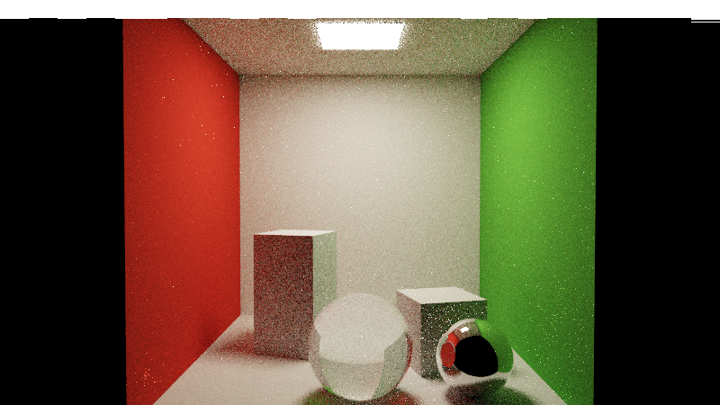
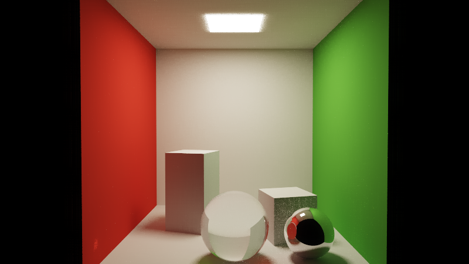

# vk-compute-pathtracer

[](LICENSE)

**纯 Vulkan compute shader 的路径追踪引擎 —— 不使用任何光追扩展、不需要 RT 硬件。**
BVH 遍历与全部求交在普通 compute shader 里手写完成;macOS 上经 MoltenVK 运行,
同一份代码可在 Windows/Linux 原生 Vulkan 及无头服务器上运行。


*1920×1080 级静态渲染:康奈尔盒,含完整全局光照 —— 红绿墙色溢出、面光源软阴影、
玻璃球折射、镜面球反射。Apple M1 (MoltenVK) 上约 4 分钟出图。*

## 渐进收敛

每帧每像素 1 条随机路径(1 spp),静止后无限累积,噪声按 1/√N 消退:

| 16 spp | 256 spp(无降噪) | 256 spp(方差引导降噪) |
|:---:|:---:|:---:|
|  |  |  |

*右图与中图采样数完全相同 —— 降噪器从累积亮度矩取每像素方差,亮区不动、
暗区自适应平滑,边缘经 G-buffer 权重保护零损失(256 spp + 降噪 ≈ 裸跑 1000+ spp)。*

## 功能

- **静态渲染**:渐进累积,Welford 增量均值,数值有界永不停滞
- **NEE 直接光**:发光三角形自动识别,面积加权 CDF 采样,首弹射 4 样本
- **透射阴影**:阴影光线穿透玻璃((1−Fresnel)),软焦散、无黑本影
- **离线降噪**:à-trous 方差引导滤波 ×5,G-buffer 边缘停止
- **光滑法线**:OBJ `vn` 重心插值 + 绕序/法线自动和解(任意绕序 OBJ 安全)
- **原生球原语**:场景级 `sphere` 关键字,引擎内部网格化,渲染器单管线零特判
- **实时预览**:交互窗口(拖拽/滚轮/WASD),离屏渲染带实时预览窗 + 进度/ETA
- **P 键快照**:从当前视角出 4096 spp 无噪成品

## 快速开始(macOS)

```bash
brew install cmake glfw glslang molten-vk vulkan-headers vulkan-loader vulkan-tools
cmake -B build -DCMAKE_BUILD_TYPE=Release && cmake --build build -j

./build/rt                                          # 交互预览,P = 4096 spp 快照
./build/rt --offscreen 4096 --size 1920x1080       # 静态渲染(带实时预览)-> out.png
# 常用: --scene path --ires WxH --snap N --nodenoise --novsync --validate
```

## 场景文件(`assets/scene.txt`)

```
#   mesh.obj  px py pz  rotYdeg  sx sy sz  material
#   sphere    cx cy cz  radius            material
#   material: auto | diffuse r g b | light r g b | mirror r g b | glass r g b ior
cornell_room.obj   0 0 0       0   1 1 1        auto
unit_box.obj      -1.08 0.99 -0.35  18   1.06 1.98 1.06  auto
unit_box.obj       1.25 0.53  0.35 -15   1.06 1.06 1.06  auto
sphere             0    0.68  1.70  0.68         glass  1 1 1 1.5
sphere             1.5  0.5   1.60  0.5           mirror 0.95 0.95 0.96
```

资产由 `assets/gen_assets.py` 生成;任何外部 OBJ(Blender 导出等)放入
`assets/` 加一行即可。`assets/scene_objtest.txt` 为全网格球对照示例。

## 渲染管线

```
scene.txt → OBJ/MTL → 变换烘焙 → 三角形流 → SAH BVH → SSBO
                                                       ↓
pathtrace.comp(追踪 + NEE + 累积 + G-buffer/亮度矩 + tonemap)
                                                       ↓ (出图时)
denoise.comp ×5(à-trous 方差引导)→ finalize.comp → PNG
```

## 实测(Apple M1 / MoltenVK / Vulkan 1.1,7972 三角形)

| 项目 | 结果 |
|---|---|
| 交互预览 1280×720 | ~10 fps,静止持续收敛 |
| 降噪收益(256 spp vs 2048 参考) | 误差 −41%~−55%,边缘梯度零损失 |
| 1600×900 × 1024 spp + 降噪 | ~3 分钟 |

## 已知边界

- 相机可移入几何体内部(双面着色不崩溃,但画面怪异)
- 镜面链经玻璃的光源计入与透射阴影存在轻微重复能量(视觉不可辨)
- MTL 纹理(`map_Kd`)未支持;材质为纯参数化
- 进程退出不逐个销毁 Vulkan 资源(由 OS 回收)

## License

[MIT](LICENSE)

## AI 生成说明 / AI Generation Notice

本项目的代码由 AI 辅助生成(GLM,经由 DeepSeek Harness),通过迭代式对话完成:
人类负责设计决策、需求定义、测试与审查。
This codebase was developed with AI assistance (GLM via DeepSeek Harness)
through iterative conversation; the human directed design decisions,
requirements, testing, and review.
